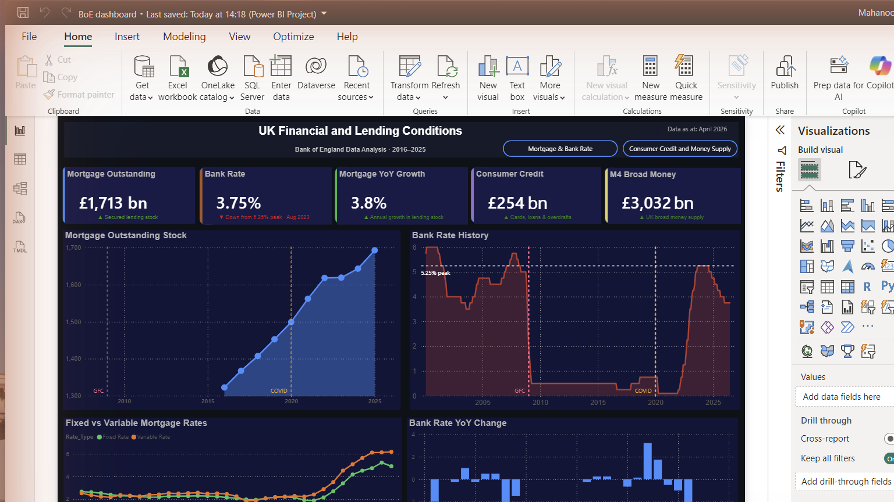
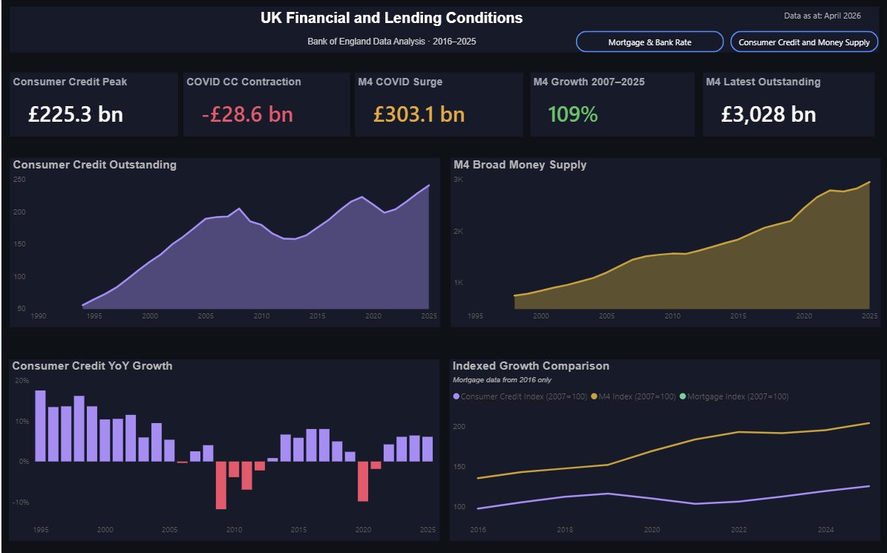
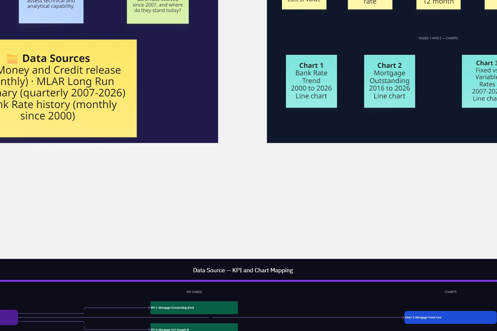
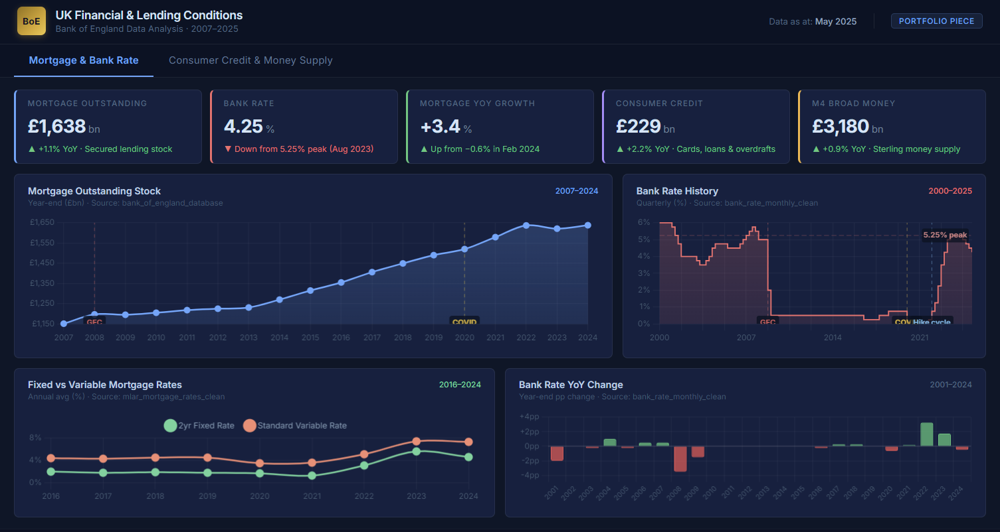
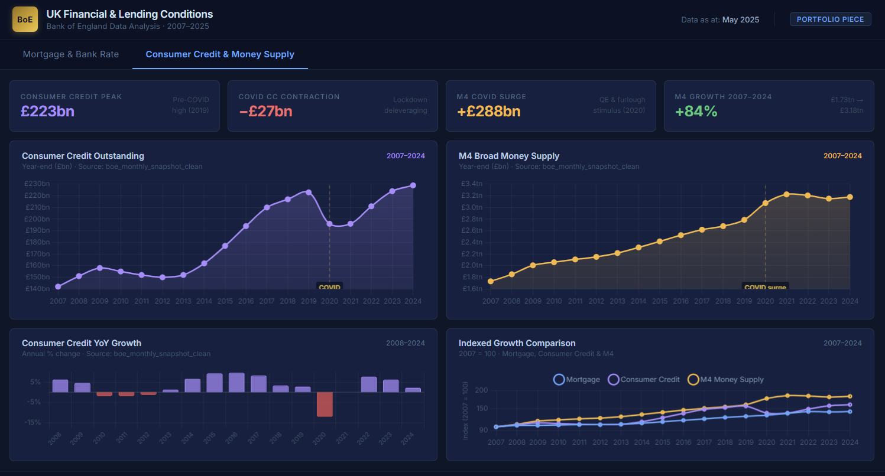

# UK Financial and Lending Conditions Dashboard

**A two-page Power BI dashboard analysing UK mortgage lending, consumer credit, money supply, and Bank Rate using publicly available Bank of England data.**

Built as a portfolio project to demonstrate financial data analysis, advanced DAX, Power Query data cleaning, and dashboard design skills.

---

## Dashboard Preview

### Page 1: Mortgage and Bank Rate



### Page 2: Consumer Credit and Money Supply



---

## Planning and Design

Miro board used for project planning and data source mapping:



Figma wireframe used before building in Power BI:





---

## Project Overview

This dashboard was built entirely from scratch using raw statistical releases from the Bank of England. It covers UK financial conditions from 2000 to April 2026 across two focused pages.

Page 1 focuses on the mortgage market and Bank Rate, showing how outstanding mortgage stock has grown over the past decade alongside the full Bank Rate cycle from near zero to the 2023 peak of 5.25 percent and the subsequent cuts to 3.75 percent. The Fixed vs Variable Mortgage Rates chart, built from the Mortgage Lenders and Administrators quarterly returns, shows how the product mix and pricing has shifted over time.

Page 2 focuses on consumer credit and broad money supply, covering the pre and post COVID deleveraging cycle in consumer credit and the significant M4 money supply expansion during 2020. The Indexed Growth Comparison chart shows all three series rebased to 100 at 2007, allowing direct comparison of how mortgage stock, consumer credit, and M4 have grown relative to each other since the financial crisis.

---

## Key Insights

The Bank Rate chart tells a clear story across three distinct eras: high rates in the early 2000s, a sustained near-zero period from 2009 to 2021, and the sharp hiking cycle that took the rate from 0.25 percent in January 2022 to 5.25 percent by August 2023, with cuts since bringing it to 3.75 percent by April 2026.

Mortgage outstanding stock grew steadily throughout, rising from £1.3 trillion in 2016 to £1.7 trillion in April 2026, with only a brief flattening visible during 2023 at the height of the rate cycle when affordability pressures slowed new lending.

Consumer credit shows the clearest COVID signal in the dataset. Outstanding balances contracted by £28.6 billion in 2020 as households deleveraged during lockdown, the sharpest one-year fall in the series. By 2024 credit had recovered and surpassed the 2019 peak of £225 billion.

M4 broad money expanded by £303 billion in 2020 alone, driven by quantitative easing and furlough related transfers. That is a larger annual expansion than any previous year in the dataset and is clearly visible as a structural step change in the M4 trend line.

---

## KPI Cards

### Page 1

| KPI | Value (April 2026) | Description |
|--|--|--|
| Mortgage Outstanding | £1,713 bn | Total secured lending stock |
| Bank Rate | 3.75% | Current official Bank Rate |
| Mortgage YoY Growth | 3.8% | Year on year change in mortgage stock |
| Consumer Credit | £254 bn | Latest total consumer credit outstanding |
| M4 Broad Money | £3,032 bn | Latest M4 money supply outstanding |

### Page 2

| KPI | Value | Description |
|--|--|--|
| Consumer Credit Peak | £225.3 bn | Pre-COVID peak reached in 2019 |
| COVID CC Contraction | -£28.6 bn | Fall in consumer credit during 2020 lockdown |
| M4 COVID Surge | £303.1 bn | M4 expansion in 2020 driven by QE and furlough stimulus |
| M4 Growth 2007 to 2025 | 109% | Total M4 growth from 2007 base to latest reading |
| M4 Latest Outstanding | £3,028 bn | Current M4 outstanding balance |

---

## Advanced DAX Measures

Eight measures were written to power the dashboard, covering a range of advanced DAX patterns.

**Latest Mortgage Outstanding (CALCULATE with ALL and VAR)**

```dax
Latest Mortgage Outstanding GBP bn =
VAR LatestDate =
    CALCULATE(
        MAX(bank_of_england_database[Date]),
        ALL(bank_of_england_database)
    )
RETURN
    CALCULATE(
        SUM(bank_of_england_database[Mortgage_Outstanding_GBP_bn]),
        bank_of_england_database[Date] = LatestDate
    )
```

**Mortgage YoY Growth (VAR with SAMEPERIODLASTYEAR and DIVIDE)**

```dax
Mortgage YoY Growth % =
VAR CurrentOutstanding =
    SUM(bank_of_england_database[Mortgage_Outstanding_GBP_bn])
VAR PriorYearOutstanding =
    CALCULATE(
        SUM(bank_of_england_database[Mortgage_Outstanding_GBP_bn]),
        SAMEPERIODLASTYEAR(Date_Table[Date])
    )
RETURN
    DIVIDE(
        CurrentOutstanding - PriorYearOutstanding,
        PriorYearOutstanding
    )
```

**Bank Rate Change from 2023 Peak (FILTER inside CALCULATE)**

```dax
Bank Rate Change from 2023 Peak =
VAR Peak2023 =
    CALCULATE(
        MAX(bank_rate_monthly_clean[Bank_Rate_Pct]),
        FILTER(
            ALL(bank_rate_monthly_clean),
            YEAR(bank_rate_monthly_clean[Date]) = 2023
        )
    )
VAR CurrentRate =
    CALCULATE(
        MAX(bank_rate_monthly_clean[Bank_Rate_Pct]),
        ALL(bank_rate_monthly_clean),
        bank_rate_monthly_clean[Date] = MAX(bank_rate_monthly_clean[Date])
    )
RETURN CurrentRate - Peak2023
```

**Mortgage Growth Band (SWITCH TRUE pattern)**

```dax
Mortgage Growth Band =
VAR GrowthRate = [Mortgage YoY Growth %]
RETURN
    SWITCH(
        TRUE(),
        ISBLANK(GrowthRate), "No Data",
        GrowthRate >= 0.05, "Strong",
        GrowthRate >= 0.02, "Moderate",
        GrowthRate >= 0, "Slow",
        "Contraction"
    )
```

---

## Data Sources

All data is sourced directly from the Bank of England and downloaded at no cost.

| File | Series | Description | Frequency |
|--|--|--|--|
| bank_of_england_database.csv | VTXK | Lending secured on dwellings, amounts outstanding | Monthly from 2016 |
| bank_rate_monthly_clean.csv | BoE baserate.xls | Official Bank Rate since 2000 | Daily, aggregated monthly |
| mlar_mortgage_rates_clean.csv | MLAR Long Run Summary | Fixed and variable rate new mortgage pricing | Quarterly from 2007 |
| boe_monthly_snapshot_clean.csv | Tables A and K | Latest monthly snapshot of consumer credit and M4 | Monthly |
| consumer_credit_historical_clean.csv | LPMBI2O | Consumer credit outstanding since 1994 | Monthly |
| m4_historical_clean.csv | RPQB53Q | M4 broad money supply outstanding since 1998 | Quarterly |

Sources: Bank of England Money and Credit release, MLAR Long Run Summary, Bank Rate history. All data is used for illustrative and portfolio purposes only.

---

## Tools and Technical Stack

| Tool | Use |
|--|--|
| Power BI Desktop | Dashboard build, DAX measures, data modelling |
| Power Query (M) | Data cleaning and transformation |
| Python (pandas) | Pre-processing of MLAR and snapshot Excel files before Power BI load |
| Bank of England database | Data source and series search |
| Figma | Dashboard wireframe and design mockup |
| Miro | Project planning and data source mapping |
| GitHub | Version control and portfolio hosting |

---

## Problems Faced and How I Resolved Them

**The Bank of England database blocked automated requests**

The CSV download URLs I initially tried returned an error page rather than data because the database requires a browser session to authenticate before downloads work. I resolved this by navigating the database manually through the search interface for each series code, which is how the site is designed to be used.

**The Bank Rate file appeared blank in Excel**

The file had saved as a binary XLS format but with a CSV extension, so Excel could not parse it. Renaming the extension from .csv to .xlsx resolved this immediately.

**The MLAR summary file lost its data when saved as CSV**

The original MLAR long run summary was a multi-sheet Excel file. Saving it as CSV only exported the first sheet, which was the contents page, not the actual data. I had to load the original Excel file directly into Power BI and select the correct sheet from the Navigator, rather than converting it first.

**Power BI auto-detected a meaningless relationship**

Power BI automatically created a relationship between boe_monthly_snapshot_clean and bank_of_england_database based on a matching pound value that appeared in both tables by coincidence. This caused incorrect cross-filtering across the model and contributed to a file freeze during loading. Deleting that relationship and rebuilding the model with only date-based relationships through the Date table resolved both the incorrect numbers and the instability.

**The MLAR table created a many-to-many relationship**

The mlar_mortgage_rates_clean table joined to Date_Table on a many-to-many basis because the Quarter text column was not unique, appearing three times per quarter, once each for Fixed Rate, Variable Rate, and All Loans. Power BI warned about significantly different behaviour from this relationship type. Removing the relationship entirely and relying on the table's natural alphabetical sort order fixed the instability and the jumbled X axis labels on the Fixed vs Variable chart at the same time, since alphabetical sort of the YYYY Q format already produces correct chronological order.

**The Bank Rate card displayed 375% instead of 3.75%**

The measure format in the Measure tools ribbon was set to Percentage, which multiplied the stored value of 3.75 by 100 before displaying it. Changing the measure format to Decimal number and adding a percent symbol manually as a card suffix corrected this. This is a common DAX trap. The Percentage format is designed for measures that return a decimal fraction like 0.0375, not for measures that already store the actual percentage value.

**The Consumer Credit YoY Growth chart showed a false -100% spike in 2026**

The measure was comparing a partial year of 2026 data against a full year of 2025 data, producing a false collapse. Adding a visual-level filter to exclude 2026 from the chart removed the spike entirely. The underlying data was correct but the chart needed to be capped at 2025 where the year-on-year comparison is complete.

**The Indexed Growth Comparison chart had no Mortgage line for most of its history**

The mortgage data only goes back to 2016 while consumer credit and M4 data goes back to the 1990s. Indexing all three series to 2007 meant the mortgage line was absent for the first nine years of the chart. Filtering the chart X axis to start from 2016 brought all three lines into view from the same starting point, and a subtitle note was added explaining that mortgage data is available from 2016 only.

---

## How to Open

Download the .pbix file and open it in Power BI Desktop. The data is embedded so no connection setup is needed. All measures and calculated columns are in the Measures table in the Data pane.

---

## About

Built by Mahanoor Shams as part of an active portfolio of data analytics projects.

LinkedIn: [linkedin.com/in/mahanoor-shams](https://linkedin.com/in/mahanoor-shams)

GitHub: [github.com/mahanoorshams](https://github.com/mahanoorshams)

*Figures are for illustrative and portfolio purposes only. All data sourced from publicly available Bank of England statistical releases.*
